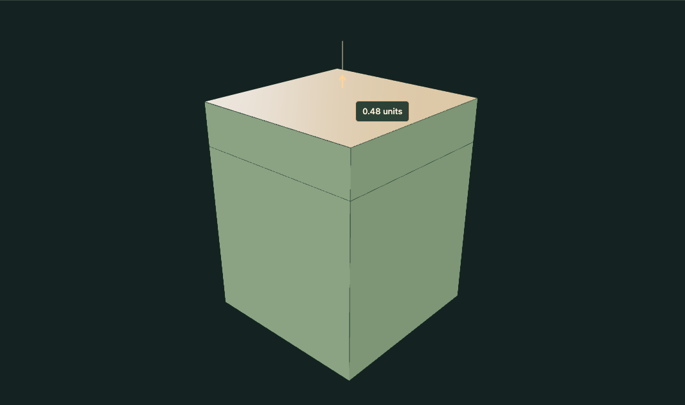
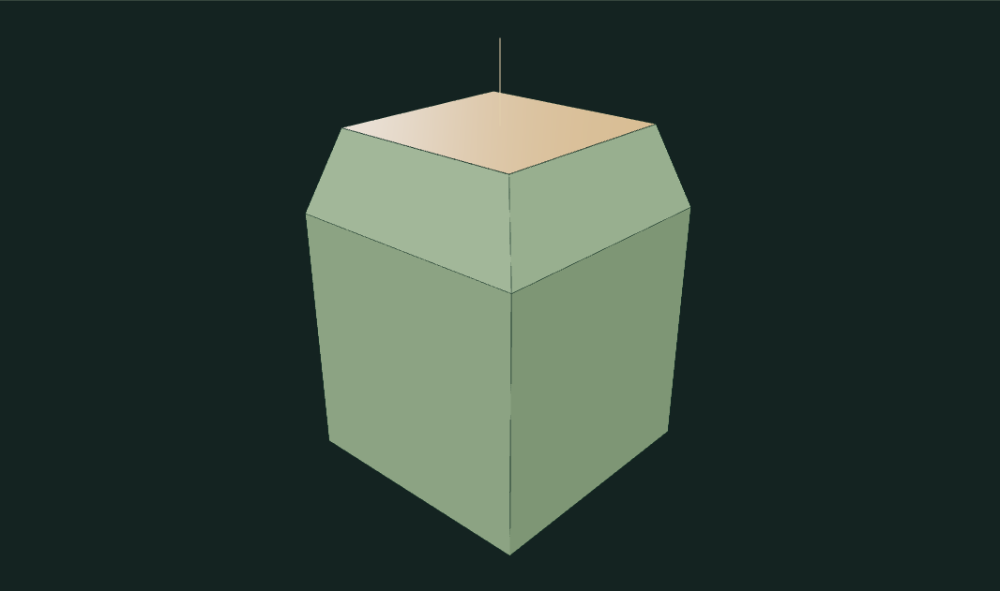

# Mesh Workshop

A small polygon modeler built around **direct face dragging**. Grab a face and pull it along its normal; the preview edits real topology and releasing saves one undo step. The standalone tool and portfolio import the same `createExperiment` module.

[Open the portfolio demo](https://zachsm.com/experiments/mesh-workshop).

## Run

Requires Node.js 22 or later.

```sh
npm ci
npm test
npm run dev
```

`npm run build` produces the static site in `dist`. No server processing, account, or GitHub Actions is required.

## Interaction

- **Drag a face:** select its nearest visible surface, pull outward to extend it, or push inward to shorten the existing face. The floating arrow and distance readout show the gesture. Clicking without moving only selects.
- **Face looking directly at the camera:** drag upward to pull it toward you. This avoids unstable projection when the normal has no useful screen-space direction.
- **Shift:** snap the pull to 0.1 model units.
- **Escape or pointer cancellation:** restore the exact pre-drag mesh. Pulling back through the start also discards the preview.
- **Background drag or right-drag:** orbit without editing the mesh.
- **Drag operation:** choose extrusion or bevel. In bevel mode, drag along the arrow for height and across it to narrow or widen the cap.
- **Keyboard:** use Previous/Next face, adjust Keyboard pull distance, then press Enter on the slider or viewport.

Inset, diagonal face cuts, subdivision, wireframe display, 24-step undo, editable geometric presets, and OBJ export remain available. There is no button-based extrusion workflow.

## How it works

Pure mesh data is `{vertices: number[][], faces: number[][]}`. A cube starts with eight shared vertices and six outward-facing quads. Extrusion replaces one cap and adds connected side faces. Inset adds a coplanar ring; the bevel variant raises a smaller cap with sloped shoulders. A diagonal cut connects existing vertices without T-junctions. Catmull–Clark subdivision creates shared edge and face points using the interior and boundary rules.

The drag axis is computed from the camera's homogeneous view-projection transform. The pointer's motion along the projected normal is inverted back into model distance, including perspective foreshortening. An end-on normal uses a camera-depth-scaled upward gesture. Preview geometry is rebuilt from one immutable pre-drag snapshot, not repeatedly extruded from the previous preview. Only release adds history. Front-face raycasting against the nearest solid triangle avoids selecting an occluded back face through the visible cap.

The exported lifecycle hooks support cached tool switching: `deactivate()` rolls back an active drag and releases pointer capture; `activate()` restores the viewport affordances. Neither switching nor a canceled gesture commits an edit.

Reference: [Catmull & Clark, *Recursively generated B-spline surfaces on arbitrary topological meshes* (1978)](https://doi.org/10.1016/0010-4485(78)90110-0).

## Verification

`npm test` exercises topology and camera-aware projection, including different camera scales, end-on fallback, inward-motion bounds, repeated previews and rollback.

```sh
npx playwright install chromium
npm run test:browser
```

The browser test starts a local Vite server, performs real mouse and touch drags, downloads and compares actual OBJ geometry, verifies one-step undo, cancels gestures, checks foreground picking, orbits, exercises keyboard operation and tests deactivation. To use an already-running server:

```sh
MESH_WORKSHOP_URL=http://127.0.0.1:5341 npm run test:browser
```

## Limits

Outward pulls add connected geometry up to 3 model units. Inward pushes move the current face vertices without adding inverted side walls, bounded by the nearest supporting layer. Moves below 0.002 units are treated as unchanged. Bevel height and cap width respond to orthogonal mouse directions within one undo transaction. Edits and subdivision are bounded to 16,000 output faces. Insets and face bevels move corners toward the centroid rather than applying a constant-distance CAD offset. Extreme edits on complex forms may intersect other surfaces: this is not a collision-aware solid modeler or an all-edge bevel modifier. Subdivision rejects nonmanifold edges.

## Captured examples



An actual drag preview. Releasing commits the whole pull as one edit.



The same direct gesture in Bevel mode creates sloped shoulder faces.

[Exact reproduction steps](examples/manifest.json).
